# MessageApp — Android-мессенджер с E2E-шифрованием


Полноценный мессенджер на Kotlin: сквозное шифрование переписки (AES-GCM + RSA в Android Keystore), real-time чат поверх WebSocket, offline-first через Room и WorkManager. Собственный backend — [ServerMessage](https://github.com/mafen1/ServerMessage) (Ktor, PostgreSQL, Docker).

## 📱 Описание

MessageApp — клиентское Android-приложение мессенджера: личные чаты с E2E-шифрованием, друзья и заявки, лента новостей с лайками и комментариями, статусы доставки сообщений и устойчивость к потере сети.

## 🚀 Технологии

- **Kotlin** — основной язык
- **Jetpack Compose** — декларативный UI + type-safe Navigation
- **Material Design 3** — компоненты и темизация
- **Hilt** — внедрение зависимостей
- **MVVM / Clean Architecture** — слои data/domain/ui
- **Room** — offline-first кэш сообщений и очередь отправки (outbox)
- **WorkManager** — синхронизация неотправленных сообщений при возврате сети
- **WebSocket** (java-websocket) — real-time чат с авто-reconnect и backoff
- **Retrofit / OkHttp** — REST API
- **DataStore** — хранение настроек и сессии
- **Coroutines / Flow / StateFlow** — асинхронность
- **E2E-шифрование**: AES-GCM + RSA (Android Keystore), ключи чатов с версионированием эпох
- **Coil** — загрузка изображений
- **LeakCanary, MockWebServer, JUnit + Mockito** — отладка и тестирование
- **Gradle (Kotlin DSL)** — система сборки
- **Android Studio / IntelliJ IDEA** — среда разработки

## 📋 Функциональность

- Отправка текстовых сообщений и изображений
- Сквозное (E2E) шифрование чатов: AES-GCM для сообщений, RSA-обёртка ключей с версионированием эпох на сервере — [архитектурная документация](docs/ARCHITECTURE.md)
- Список чатов, друзья и заявки в друзья
- Лента новостей с лайками и комментариями
- Оффлайн-режим: локальный кэш (Room) и очередь неотправленных сообщений (WorkManager)
- Статусы сообщений (отправлено / доставлено), дедупликация по clientMessageId
- Автоматический реконнект WebSocket с экспоненциальной задержкой

## 🛠 Установка и запуск

### Требования

- Android Studio Hedgehog или новее
- JDK 11+
- Android SDK 24+ (Android 7.0)

Запуск сервера — см. репозиторий [ServerMessage](https://github.com/mafen1/ServerMessage) (`docker compose up --build`). По умолчанию debug-сборка обращается к `http://10.0.2.2:8081` (эмулятор → localhost).

### Запуск проекта

1. Клонируйте репозиторий:

```bash
git clone https://github.com/mafen1/MessageApp.git
```

2. Откройте проект в Android Studio

3. Синхронизируйте Gradle-зависимости

4. Запустите на эмуляторе или физическом устройстве

## 📁 Структура проекта

```
MESSAGEAPP/
├── app/
│   ├── src/main/
│   │   ├── java/com/example/messageapp/
│   │   │   ├── ui/mainScreen/MainActivity.kt   # Единственная Activity
│   │   │   ├── ui/navigation/                  # Навигация Compose
│   │   │   ├── ui/theme/                       # Тема, цвета, типографика
│   │   │   ├── ui/components/                  # Переиспользуемые компоненты
│   │   │   ├── ui/screen/                      # Экраны на Compose
│   │   │   ├── data/                           # Модели данных и сеть
│   │   │   └── domain/                         # Use cases и репозитории
│   │   └── res/                                # Ресурсы (drawable, strings)
│   └── build.gradle.kts                        # Зависимости модуля app
├── build.gradle.kts                            # Корневая конфигурация
├── settings.gradle.kts
└── gradle.properties
```

## 🔗 Связанные проекты

- **ServerMessage** — backend-сервер мессенджера (Ktor, PostgreSQL, Docker): [github.com/mafen1/ServerMessage](https://github.com/mafen1/ServerMessage)

## 📈 Roadmap

- [x] Отправка текстовых сообщений и изображений
- [x] E2E-шифрование чатов с ротацией ключей (версии эпох на сервере)
- [x] Offline-first: кэш Room + очередь отправки через WorkManager
- [x] Статусы сообщений: отправляется / отправлено / доставлено / не доставлено
- [x] Экран заявок в друзья с бейджем-счётчиком
- [x] Pull-to-refresh и автообновление ленты новостей
- [x] Unit-тесты (шифрование, репозитории, ViewModel) и интеграционные тесты API
- [ ] Уведомления о новых сообщениях (foreground service)
- [ ] Статус «прочитано» (read-receipts)
- [ ] UI-тесты на Compose

## 📸 Скриншоты

<table>
  <tr>
    <td>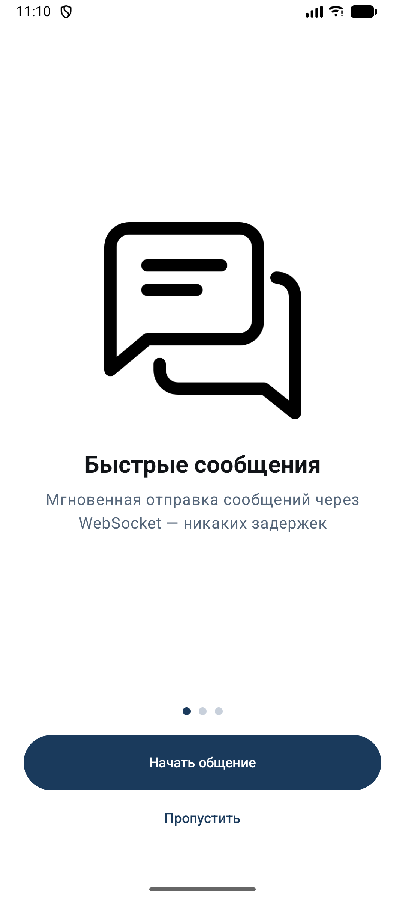</td>
    <td>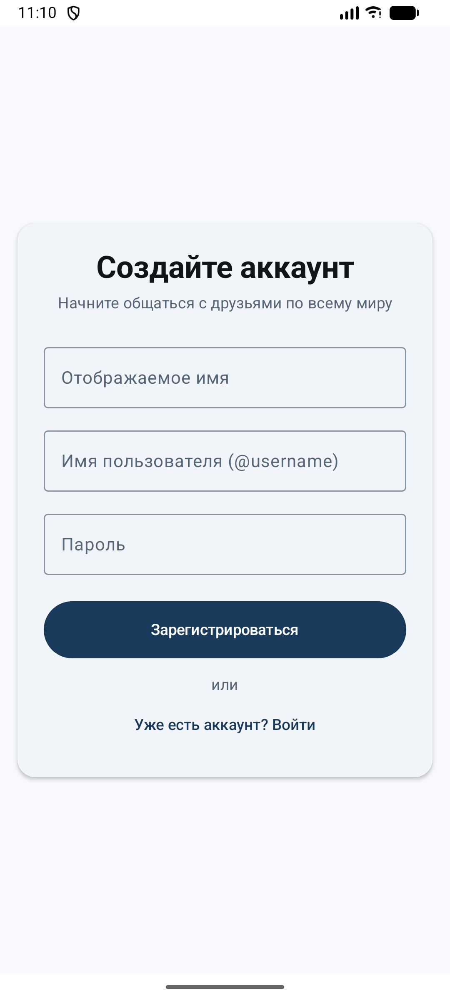</td>
    <td>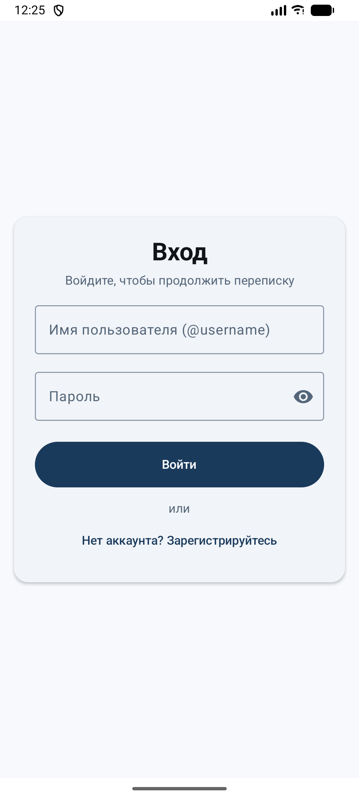</td>
  </tr>
  <tr>
    <td>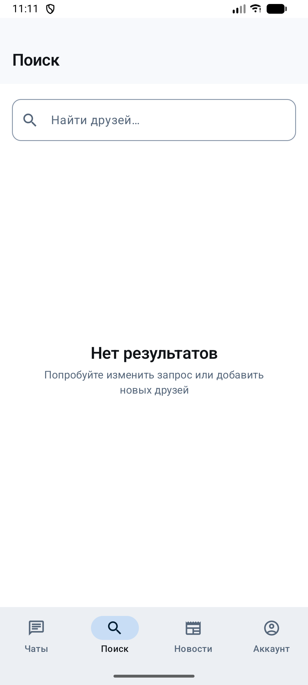</td>
    <td>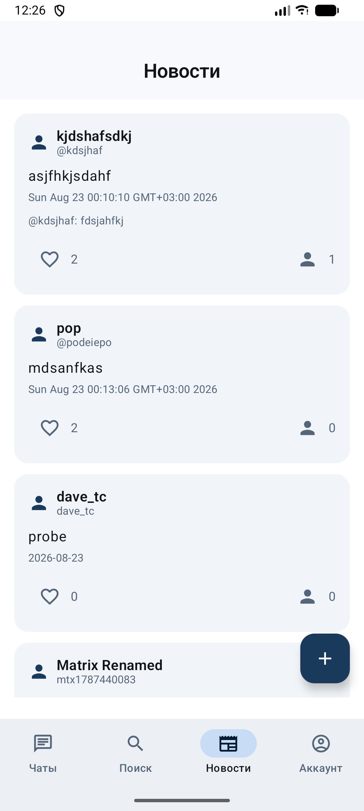</td>
    <td>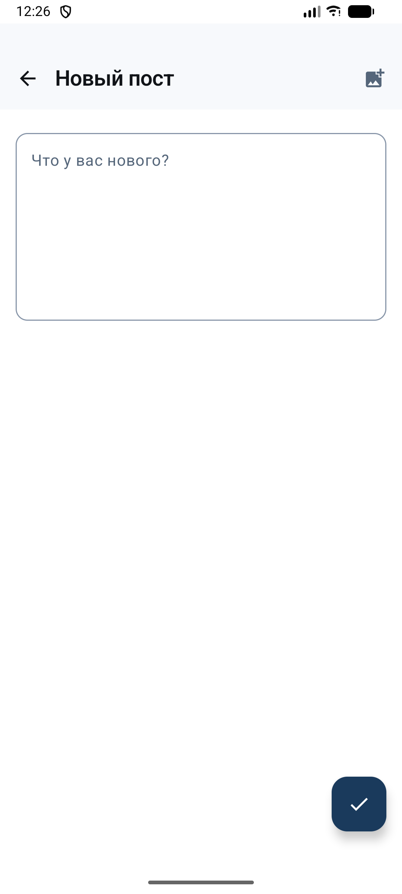</td>
  </tr>
  <tr>
    <td>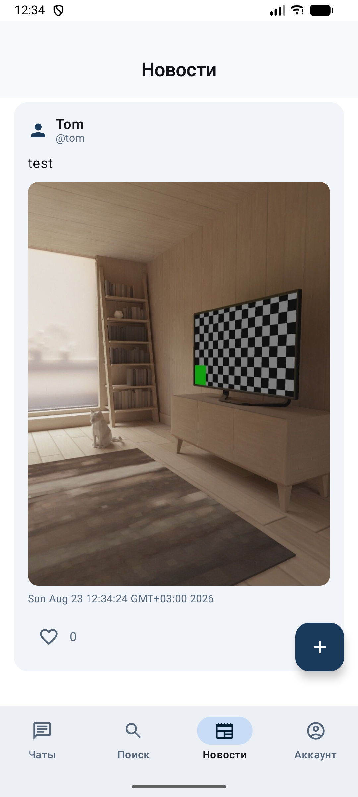</td>
    <td>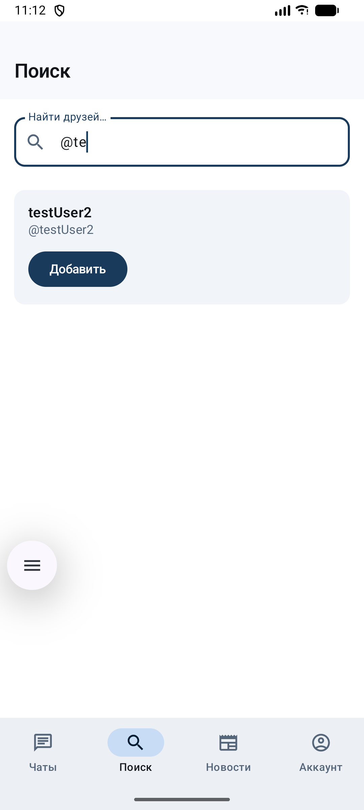</td>
    <td>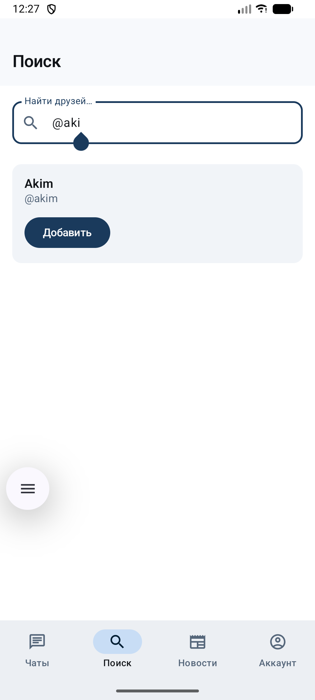</td>
  </tr>
  <tr>
    <td>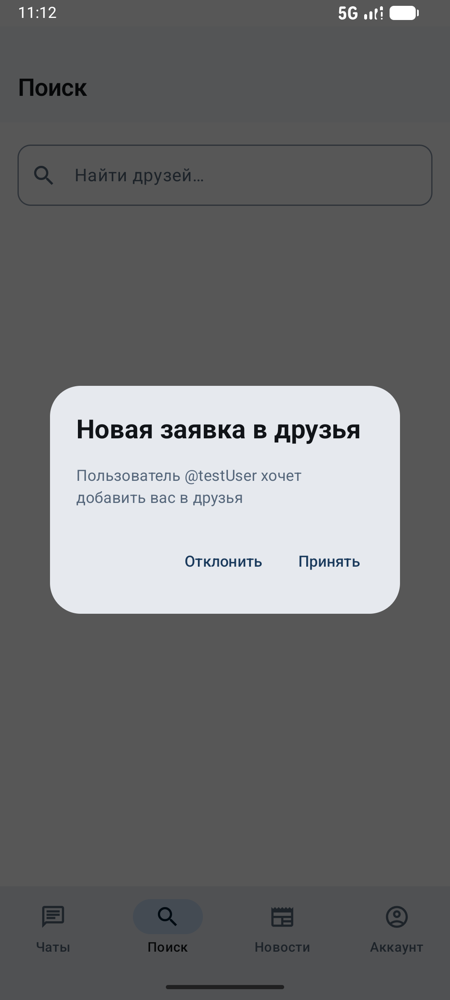</td>
    <td>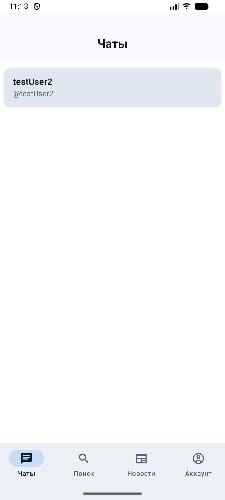</td>
    <td>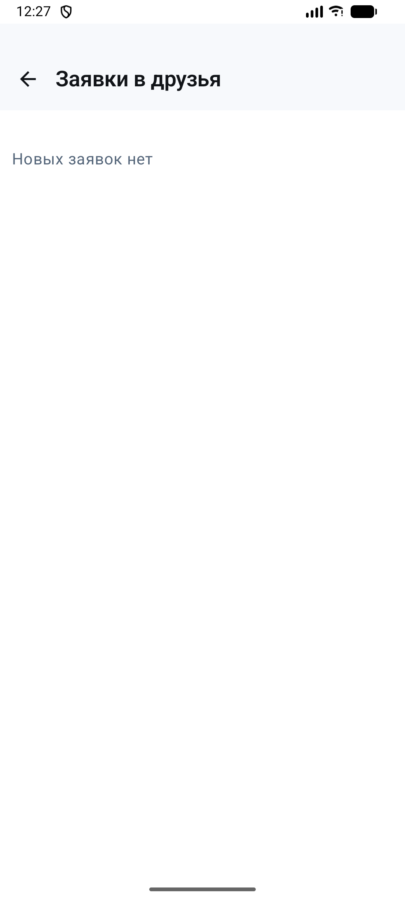</td>
  </tr>
  <tr>
    <td>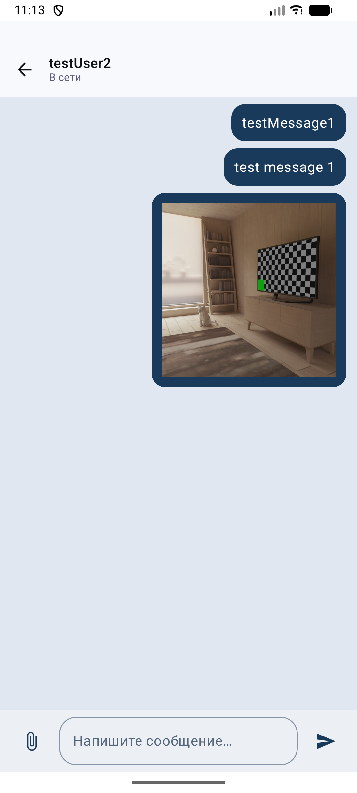</td>
    <td>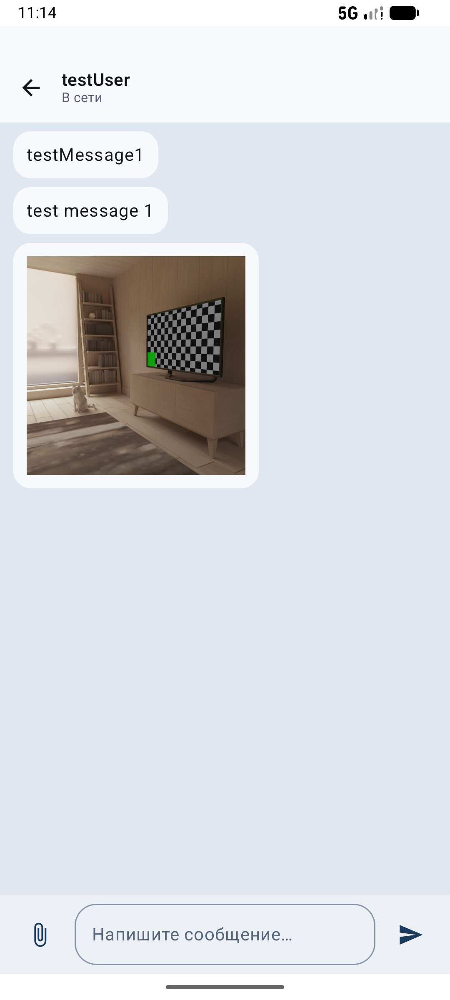</td>
    <td>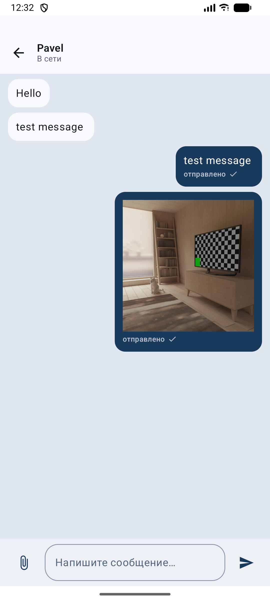</td>
  </tr>

 <tr>
    <td>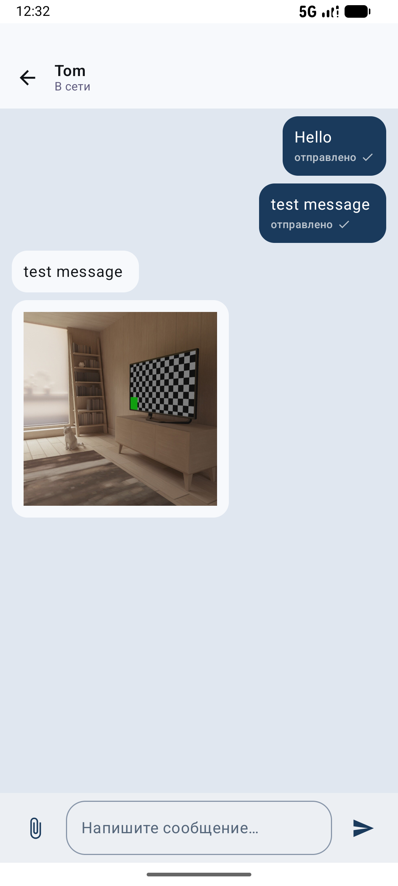</td>
    <td>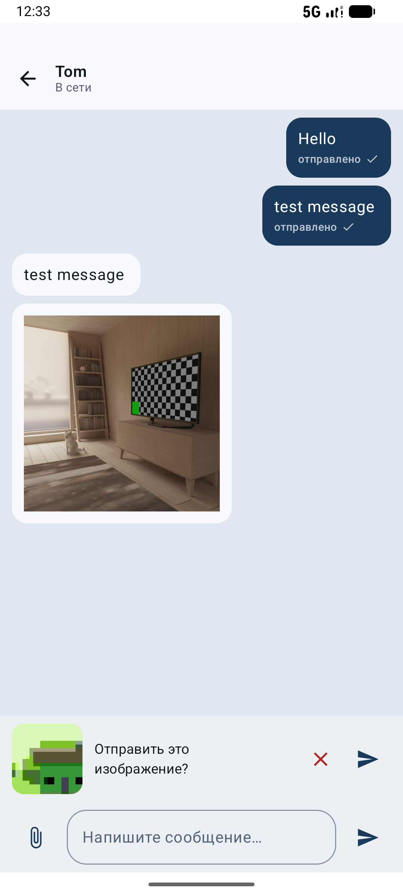</td>
 </tr>
</table>

## 👨‍💻 Автор

**mafen1** — [GitHub](https://github.com/mafen1)

## 📄 Лицензия

MIT
